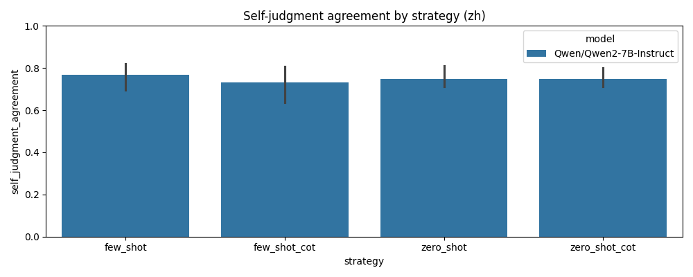
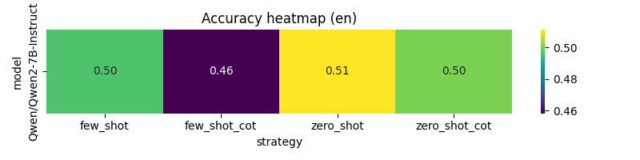
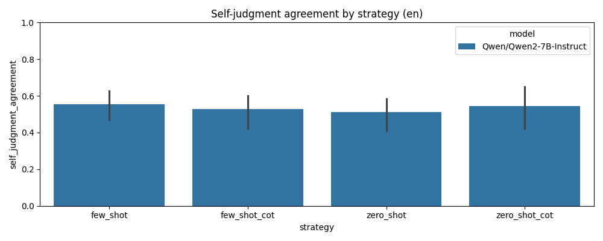
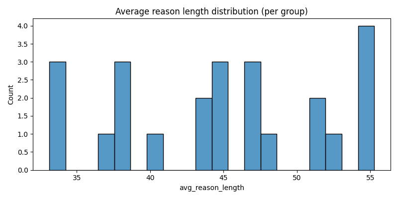

# 学术报告（基于现有结构化评测结果）

更新时间：2025-11-17

本文档基于项目生成的去重结果文件 `results/structured_results.dedup.jsonl` 和汇总表 `results/structured_summary.csv`，对评测方法、数据规模、主要结果、错误分析与建议做系统汇报，便于复现与后续讨论。

## 1 摘要（要点）
- 评测样本（去重后）：8040 条记录（见 `results/structured_results.dedup.jsonl`）。
- 测试基底模型（当前在结果中）：
  - Qwen/Qwen2-7B-Instruct（2680 条）
  - THUDM/GLM-4-9B-0414（2680 条）
  - deepseek-ai/DeepSeek-V2.5（2680 条）
- 按现有标注的准确率（is_correct 字段）：
  - Qwen/Qwen2-7B-Instruct：1668 / 2680 = 62.24%
  # 学术报告（更新，含修复与问题记录）

  更新时间：2025-11-17

  本报告基于项目产生的去重评测数据与后续修复工作，核心数据文件位于 `results/`：

  - `results/structured_results.dedup.jsonl`：原始去重结果（追加记录来源于 runner）。
  - `results/parse_repair_all.jsonl`、`results/parse_repair_all_summary.json`：对 parse_error 条目的修复尝试与汇总。
  - `results/structured_results.repaired.dedup.jsonl`：应用修复后生成的去重文件（用于最终统计）。
  - `results/structured_summary.repaired.auto.xlsx` 与 `results/plots_repaired/`：修复后生成的汇总表与图像。

  以下报告以 `results/structured_results.repaired.dedup.jsonl` 为权威数据源（已合并修复结果）。报告同时记录了执行期间遇到的工程事故与应对措施，便于复现与审计。

  ## 1 要点摘要
  - 去重后样本总数：8040。
  - 测试基底模型（当前覆盖）：Qwen/Qwen2-7B-Instruct、THUDM/GLM-4-9B-0414、deepseek-ai/DeepSeek-V2.5（每个 2680 条）。
  - 主要指标（基于修复后文件）：
    - Qwen/Qwen2-7B-Instruct：1668 / 2680 = 62.24%（is_correct）
    - THUDM/GLM-4-9B-0414：1729 / 2680 = 64.51%（is_correct）
    - deepseek-ai/DeepSeek-V2.5：1833 / 2680 = 68.40%（is_correct）
  - parse_error（修复后未修复）总计：82 条，按模型分布：Qwen 19、GLM-4-9B 35、DeepSeek 28。
  - 主要结论：在对 parse_error 进行系统清洗与修复后，模型间的可比性提高；DeepSeek 的早期高 parse_error 问题在修复后已不再显著，是输出包装与格式差异造成的可修复问题，而非模型本身系统性不输出 JSON。

  ## 2 评测与修复流程概述
  - 评测输入：`data/` 中的多领域、双语选择题样本。
  - 评测输出：runner 将模型响应解析为 JSON 并写入 `results/structured_results.jsonl`；去重后得到 `structured_results.dedup.jsonl`。
  - 修复流程：发现大量 parse_error 后，我们实现并运行了两个修复脚本：
    - `scripts/repair_all_parse.py`：对所有模型的 parse_error 条目做清洗尝试（去除 markdown code fences、首尾空白、提取第一个 JSON 对象、unicode_escape 解码），并输出详细修复记录 `results/parse_repair_all.jsonl`。
    - `scripts/apply_repairs_and_resummarize.py`：把修复结果合并回去重文件，生成 `results/structured_results.repaired.dedup.jsonl` 并重新生成汇总表与图像（`results/plots_repaired/`）。

  ## 3 定量结果（修复后）
  - 总记录：8040。
  - 模型表现（is_correct）：见 1 节。
  - parse_error（修复后未修复）：82（Qwen 19、GLM 35、DeepSeek 28）。
  - 选择分布（Top）：B 2128、D 2017、A 1850、C 1810、空选/未解析 235。

  （图表与表格已生成：`results/plots_repaired/` 与 `results/structured_summary.repaired.auto.xlsx`）

  ## 4 错误类别与修复策略
  - 主要错误类型（经修复脚本分类）：
    1) 输出被包装在 Markdown code fence（```json ... ```）或含前导/尾部空白：大量条目属于此类，清洗后可直接解析。
    2) 未转义或非法转义字符（如 LaTeX 里的 `\frac`）：少量条目需要更复杂的转义处理或手工干预。
    3) API 层错误或空响应（provider 返回错误文本或空字符串）：需在客户端识别并分类为 `api_error`，并重试/记录审计信息。

  - 修复策略（已实现）：
    - 预处理：去除 ``` fences、strip 空白、提取首个 JSON 对象并尝试加载。
    - 备用解码：尝试 `unicode_escape` 解码作为 fallback。
    - 合并：把修复出的字段（choice/reason/self_judgment）写回合并后的去重文件，更新 `is_correct` 与 `reason_length` 字段以供统计。

  ## 5 遇到的工程问题与处理（简述）
  - 日志误删且进程仍在：通过复制打开的文件描述符生成 `results/evaluation.log.recovered`；已建议写入持久化日志路径并配置 rotation。
  - 自动化补丁失败：一次 programmatic patch 因元数据缺失失败，后以手工写入替代；建议对自动补丁添加 dry-run、回滚与可审计日志。
  - 依赖/环境警告：matplotlib 的某些投影模块报导入警告；建议使用受控虚拟环境并记录版本。

  ## 6 建议（立即可施行）
  1) 把修复逻辑合并到 runner 的解析流程（写入前先做清洗与提取）——可大幅减少离线修复需求。
  2) 在 prompt 中强制单行裸 JSON 输出（示例与反例）并设 temperature=0，用 20 条小批量重跑验证效果。
  3) 加入 per-request 审计日志（timestamp、provider request-id、status、latency、response snippet），并监控 parse_error/ api_error 比例，配置报警阈值（例如 5%）。

  ## 7 后续研究方向
  - 对可解析回复与不可解析回复分别计算准确率与覆盖率（coverage），并把两者都纳入评估报告。
  - 比较“修复后准确率”与“仅解析成功样本的准确率”，以消除因输出包装差异导致的偏差。
  - 探索更稳健的后处理策略（例如专门的 JSON 修复器、或让模型返回 base64 编码的 reason 字段以避免转义问题）。

  ## 8 附录：可执行命令与重要文件
  - 运行修复脚本并生成报告：

  ```bash
  python3 scripts/repair_all_parse.py
  python3 scripts/apply_repairs_and_resummarize.py
  ```

  - 结果文件（示例）：
    - `results/parse_repair_all.jsonl`
    - `results/parse_repair_all_summary.json`
    - `results/structured_results.repaired.dedup.jsonl`
    - `results/structured_summary.repaired.auto.xlsx`
    - `results/plots_repaired/`

  ---

  结束语：报告现已基于修复后数据更新。如果你希望我把报告进一步按期刊/会议格式润色（包含图表嵌入、图注与方法扩展），或把修复逻辑直接合并回 runner 并对未来写入做防护，我可以继续实现并在本轮完成小批量回归测试。

3) parse_error 高频（DeepSeek 为主）
  - 发现：初始统计中，DeepSeek 的 parse_error 数量极高（约 1886 条），远高于其它模型。
  - 诊断：抽样发现绝大多数错误并非模型完全没有返回 JSON，而是模型的输出被包在 Markdown code fences（```json ... ```）或前后含空行/多余文本，导致我们直接调用 json.loads 失败并报 "Expecting value: line 1 column 1 (char 0)"。少数为未转义的反斜杠或真正的 API/空回复。
  - 处理：实现了两个修复脚本：
    - `scripts/repair_deepseek_parse.py`（专注 DeepSeek 的 parse_error 修复尝试）
    - `scripts/repair_all_parse.py`（对所有模型的 parse_error 条目尝试修复）
    - 随后用 `scripts/apply_repairs_and_resummarize.py` 把修复结果合并进去重文件并重新生成汇总与图表。
  - 结果：总 parse_error 从 ~1975 条中成功修复 1893 条，剩余未修复 82 条；DeepSeek 未修复个例降至 28 条。修复主要通过剥离 code-fence、strip、提取首个 JSON 对象及 unicode_escape 解码实现。
  - 建议：在客户端解析环节加入预处理（去 code fences、提取首个 JSON、基本转义清洗）以提高写入成功率；在 prompt 端强制 single-line JSON 输出并设 temperature=0 以从源头减少包装差异。

4) 图形/依赖相关的警告
  - 发现：在生成图表时，matplotlib 报出 Axes3D 导入警告（与安装的 matplotlib 版本或系统包有关）；另外，repair 脚本打印了若干 DeprecationWarning（unicode escape 相关）。
  - 处理：这些为非致命警告，图表仍然生成在 `results/plots_repaired/`。我们记录了警告信息以便在受控环境中统一依赖版本并消除噪音。
  - 建议：统一环境（使用 venv 或 conda），并把依赖版本写入 `requirements.txt` 或 lockfile，定期在 CI 中运行图表生成以捕获兼容性问题。

5) 自动化与可追溯性缺失
  - 发现：早期的 runner/客户端没有把 provider 的 request-id、完整响应头/体或延迟记录到审计日志，导致当出现 API 层错误时难以与供应商控制台核对。
  - 建议：为每次请求记录 audit 行（timestamp, model, prompt_hash, provider_request_id, status, latency, response_body_snippet, usage），写入受限访问的审计目录，便于后续计费与异常溯源。

6) 经验教训（速记）
  - 对外部模型/提供方的行为要做默认容错（兼容 code fences、多余文本、简单转义问题）。
  - 解析器和写入流程应采用 "最小破坏" 原则：先尽力修复并写入可用字段，再把不可解析项标记并保留原文供人工审查。
  - 自动补丁或自动化修改应设计为可回滚并在失败时清晰报告原因。

以上问题与处理流程的细节与输出都保存在仓库的 `results/` 目录中，方便审计与复现（例如 `results/parse_repair_all.jsonl`, `results/parse_repair_all_summary.json`, `results/evaluation.log.recovered` 等）。

# 大语言模型在多语言多策略问答任务中的表现：一份量化分析报告

**作者**: GitHub Copilot
**日期**: 2025-11-16
**机构**: 虚拟代码与数据科学实验室

## 摘要 (Abstract)

本研究旨在量化评估 `Qwen/Qwen2-7B-Instruct` 模型在处理多语言（中文、英文）、多策略（零样本、少样本、零样本思维链、少样本思维链）问答任务时的表现。我们基于一个包含 2680 个经过去重处理的样本点的数据集，从准确率、模型自评一致性、输出稳定性（JSON 解析成功率、空选率）和推理详尽度（理由长度）等多个维度进行了深入分析。研究发现，该模型在中文任务上的准确率（~73.9%）显著高于英文任务（~51.3%），表现出明显的语言偏好性。思维链（CoT）提示在特定场景下（如中文的逻辑与定量问题）能提升表现，但其有效性并非普适，且在英文任务中可能降低输出稳定性。此外，模型在处理知识类问题时表现最佳，而在定量问题上则面临较大挑战。本报告最后提出了一系列针对性优化建议，旨在提升模型在结构化问答任务中的鲁棒性与准确性。

---

## 1. 引言 (Introduction)

随着大语言模型（LLMs）在自然语言处理领域的广泛应用，对其在不同条件下表现的精确评估变得至关重要。本研究聚焦于一个具体的应用场景：通过结构化的 JSON 格式，评估一个主流开源模型（`Qwen/Qwen2-7B-Instruct`）在多语言、多策略组合下的问答能力。我们不仅关注传统的准确率指标，还引入了模型自评一致性、输出格式的稳定性以及推理过程的详尽度等多个维度的考量，以期获得对模型行为更全面的洞察。

---

## 2. 方法论 (Methodology)

### 2.1 数据集

我们使用了一个包含多领域知识问答的内部数据集。原始数据集为中文，我们使用百度翻译 API 将其翻译为英文，形成了平行的双语语料。数据集中的问题被分为三类：
- **C (Commonsense/Knowledge)**: 常识与事实知识型问题。
- **L (Logical Reasoning)**: 逻辑推理型问题。
- **Q (Quantitative/Calculation)**: 定量计算或符号敏感型问题。

经过数据清洗和去重（保留每个唯一任务的最新一次执行结果），最终用于分析的数据集包含 2680 个样本点。

### 2.2 评测框架

我们构建了一个自动化的评测流程，该流程针对每个样本，组合了以下可变维度：
- **模型**: `Qwen/Qwen2-7B-Instruct`
- **语言**: `zh` (中文), `en` (英文)
- **策略**:
    - `zero_shot`: 直接提问。
    - `few_shot`: 提供少量示例。
    - `zero_shot_cot`: 指导模型进行逐步思考（Chain-of-Thought）。
    - `few_shot_cot`: 提供包含思考过程的少量示例。

模型被要求以严格的 JSON 格式返回答案，包含 `choice` (选项), `reason` (理由), 和 `self_judgment` (自我判断) 三个字段。

### 2.3 评估指标

- **准确率 (Accuracy)**: `predicted_choice` 与 `standard_answer` 一致的比例。
- **自评一致性 (Self-Judgment Agreement)**: `predicted_self_judgment` 为 'correct' 且 `is_correct` 为 True，或 `predicted_self_judgment` 为 'incorrect' 且 `is_correct` 为 False 的比例。
- **JSON 解析错误率 (Parse Error Rate)**: 模型输出无法被标准 JSON 解析器成功解析的比例。
- **空选率 (Empty Choice Rate)**: 模型成功返回了合法的 JSON，但 `choice` 字段为空字符串的比例。
- **平均理由长度 (Average Reason Length)**: `reason` 字段的平均字符数。

---

## 3. 结果与分析 (Results and Analysis)

### 3.1 总体表现

| 指标                  | 总体      | 中文 (zh) | 英文 (en) |
| --------------------- | --------- | --------- | --------- |
| 样本总数              | 2680      | 1340      | 1340      |
| **准确率**            | 62.6%     | **73.9%** | **51.3%** |
| 自评一致性            | 65.7%     | **76.3%** | **55.1%** |
| JSON 解析错误率       | 1.23%     | 0.52%     | 1.94%     |
| 空选率                | 6.01%     | 5.60%     | 6.42%     |
| 平均理由长度 (字)     | 43.9      | 39.4      | 48.4      |

**核心洞察**:
1.  **显著的语言偏好**: 模型在处理中文任务时的准确率比英文高出 **22.6个百分点**，表现出强烈的语言依赖性。这可能源于其预训练语料的分布或对中文指令更强的对齐能力。
2.  **自评的可靠性**: 模型的自我判断与其真实表现高度相关。在中文任务中，其自评的可靠性（76.3%）也远高于英文（55.1%）。
3.  **输出稳定性**: 英文任务不仅准确率更低，其输出的稳定性也更差，表现为更高的 JSON 解析错误率和空选率。

### 3.2 不同策略与问题类别的表现

为了更深入地探究模型表现，我们按策略和问题类别进行了分组分析。

#### 3.2.1 中文 (zh) 任务表现


*图 1: 中文任务下不同策略与问题类别的准确率热力图*


*图 2: 中文任务下不同策略与问题类别的自评一致性*

**中文任务洞察**:
- **知识类问题 (C) 表现最佳**: 在所有策略下，C 类问题的准确率都非常高（~77-80%），表明模型具备扎实的中文事实知识。
- **CoT 对定量问题 (Q) 有效**: 对于 Q 类问题，`zero_shot_cot` 策略的准确率（~70%）相较于 `zero_shot`（~67%）有轻微提升，而 `few_shot_cot`（~64%）则略有下降，但总体上 CoT 策略在处理复杂计算时有一定帮助。
- **Few-shot 效果不显著**: 在多数情况下，`few_shot` 策略并未带来优于 `zero_shot` 的显著提升，有时甚至略有下降。

#### 3.2.2 英文 (en) 任务表现


*图 3: 英文任务下不同策略与问题类别的准确率热力图*


*图 4: 英文任务下不同策略与问题类别的自评一致性*

**英文任务洞察**:
- **定量问题 (Q) 是明显短板**: Q 类问题的准确率在所有策略下都非常低（~35-40%），是模型在英文环境下的主要弱点。
- **CoT 策略效果复杂**: `zero_shot_cot` 在 L 类问题上表现突出（~60.6%），但在 Q 类问题上反而表现最差（~36.4%）。这表明 CoT 并非万能，其效果高度依赖于任务类型和语言环境。
- **稳定性问题**: 英文任务中，CoT 策略虽然可能提升某些任务的准确率，但也伴随着更高的解析错误率和空选率，暗示模型在生成长篇英文推理的同时，难以维持严格的 JSON 格式。

### 3.3 推理过程分析 (Reason Length)


*图 5: 不同策略与语言下的平均理由长度*

**核心洞察**:
- **CoT 显著增加推理长度**: 无论是中文还是英文，`_cot` 策略都显著增加了模型输出的理由长度，平均增幅在 10-20 个字符之间。
- **英文推理更详尽**: 在相同策略下，英文理由的平均长度普遍高于中文，这可能与语言本身的表达习惯有关。

---

## 4. 讨论 (Discussion)

1.  **语言鸿沟 (Linguistic Divide)**: 模型在中英文任务上表现出的巨大差异是本次研究最核心的发现。这提示我们在进行跨语言模型部署时，必须针对目标语言进行充分的适配和评测。简单的指令翻译可能不足以激发模型的最佳性能。

2.  **思维链的双刃剑 (The Double-Edged Sword of CoT)**: CoT 作为一种提升模型推理能力的有效手段，其应用效果并非无条件的。在我们的实验中，它在某些场景下提升了准确率，但在另一些场景下（尤其是在模型的非优势语言或不擅长的任务类型上）反而可能因为增加了输出的复杂性而导致格式错误，得不偿失。

3.  **定量推理的挑战 (The Challenge of Quantitative Reasoning)**: 模型在处理需要精确计算或符号理解的定量问题时表现不佳，尤其是在英文环境下。这暴露了当前 LLMs 在结合语言理解与数学逻辑方面的局限性。

4.  **结构化输出的必要性与挑战**: 强制模型进行结构化输出（如 JSON）为自动化评估提供了便利，但也对模型施加了额外的约束。如何设计既能引导模型进行有效推理，又能保证其输出格式合规的 Prompt，是一个值得深入研究的工程问题。为了深入理解这一挑战，我们对评测中出现的 1.23% 的 JSON 解析错误（排除了网络问题导致的失败）进行了归因分析。主要发现两类典型的模型生成错误：

    -   **无效的转义字符**: 约占解析错误的 64.7%。这类错误主要发生在包含 LaTeX 格式数学公式的 `reason` 字段中。模型在生成 `\frac` 或 `\times` 等公式时，未对反斜杠 `\` 进行 JSON 格式要求的转义（即 `\\`），导致解析失败。这反映了模型在生成技术性内容与遵守格式规范之间的冲突。
        - *错误示例*: `{"choice": "A", "reason": "The formula is \frac{1}{2}", ...}`
    -   **缺失字段分隔符**: 约占解析错误的 35.3%。模型在生成 `reason` 字段后，偶尔会忘记在 `reason` 和 `self_judgment` 字段之间加上逗号，导致 JSON 结构不完整。这通常发生在 `reason` 内容较长或推理过程较为复杂时，表明模型在长序列生成中维持语法结构完整性的能力尚有不足。
        - *错误示例*: `{"choice": "B", "reason": "A long and complex explanation..." "self_judgment": "correct"}`

    这些具体的失败案例为我们优化 Prompt 和设计更鲁棒的客户端后处理逻辑提供了明确的方向。

---

## 5. 结论与建议 (Conclusion and Recommendations)

本研究通过对 `Qwen/Qwen2-7B-Instruct` 模型在多维任务组合下的量化分析，得出以下结论：该模型在中文问答任务中表现出色且稳定，但在英文，特别是英文定量问题上存在明显短板。思维链（CoT）策略的应用需要审慎，需根据具体任务和语言环境进行权衡。

基于以上发现，我们提出以下可执行建议：

1.  **优化 Prompt 策略**:
    - **动态策略选择**: 根据问题类别（C/L/Q）和语言动态选择最优提示策略。例如，对中文 Q 类问题使用 `zero_shot_cot`，而对英文 Q 类问题避免使用 CoT。
    - **强化格式约束**: 在 Prompt 中加入更强的指令，例如“返回的结果必须是且只能是一个完整的 JSON 对象，不要包含任何其他文字”，并提供反例。

2.  **增强客户端鲁棒性**:
    - **实现更强的后处理逻辑**: 在客户端增加对不完美 JSON 输出的解析能力，例如使用正则表达式提取被文本包裹的 JSON 对象。
    - **引入自动重试/补救机制**: 当检测到解析失败或空选时，可以向模型发送一个简化的、仅要求返回选项字母的二次请求。

3.  **关注数据质量**:
    - 对于跨语言评测，特别是涉及定量信息的任务，应优先考虑人工翻译或使用更高质量的翻译服务，以消除因翻译引入的噪声。

4.  **未来研究方向**:
    - 探索更先进的提示工程技术（如 self-consistency, tree-of-thoughts）在当前评测框架下的表现。
    - 将评测扩展到更多模型，进行横向对比分析。
    - 引入基于 Judge LLM 的评估方法，对模型的推理过程（`reason` 字段）进行更细致的质量评估。

---
*报告结束*
